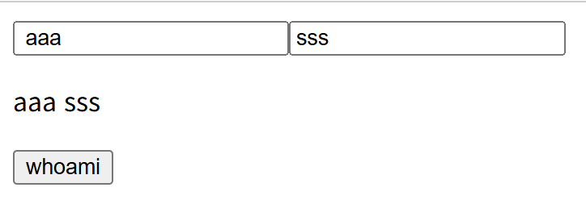
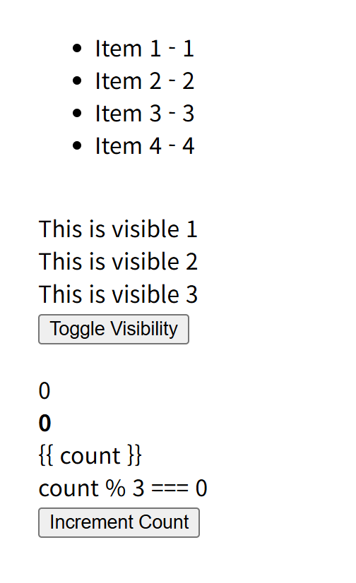
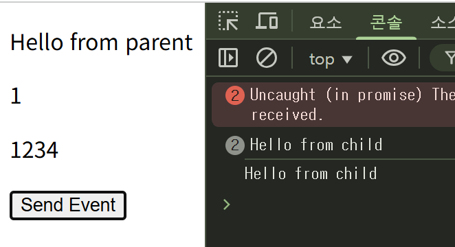
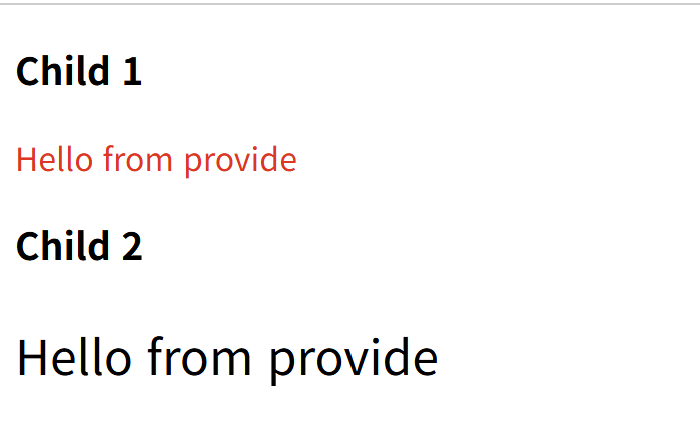
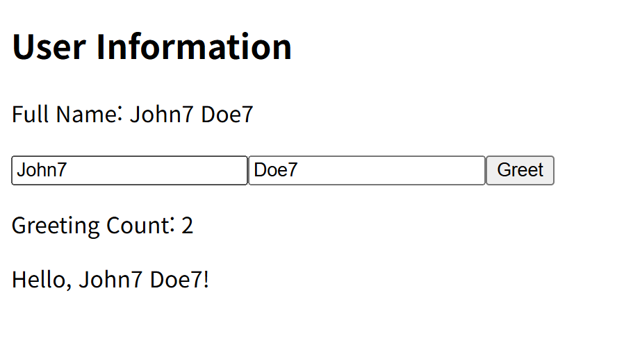
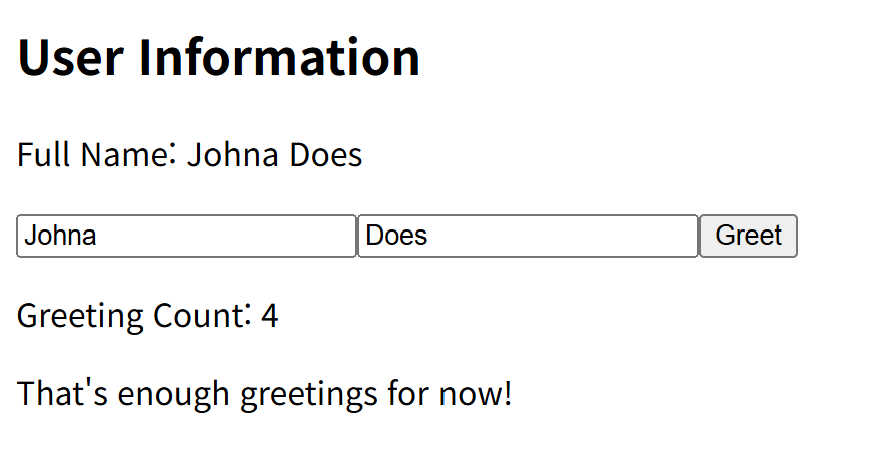
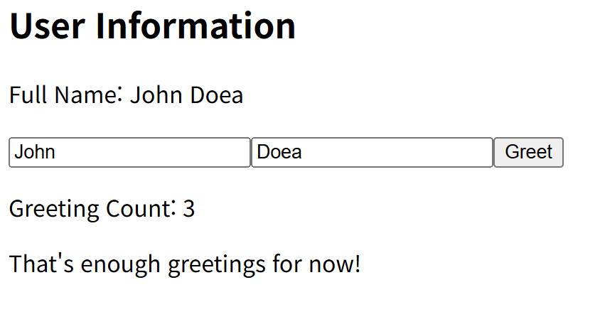
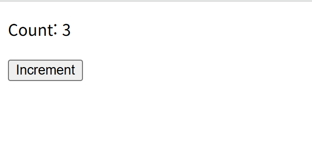
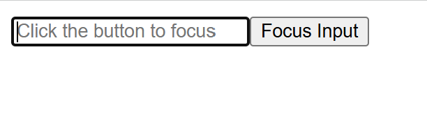

# Vue2 → Vue3 변경 요약

Vue 2의 Options API에서 Vue 3의 Composition API로 변경한 핵심 사항을 정리한 가이드입니다.

---

## 📋 핵심 API 변경 요약

| 항목 | Vue 2 | Vue 3 |
|------|-------|-------|
| 반응형 데이터 | `data()` | `ref()` / `reactive()` |
| 계산 속성 | `computed` | `computed()` |
| 메서드 | `methods` | `setup()` 내 함수 |
| 라이프사이클 | `mounted()` | `onMounted()` |
| 값 접근 | `this.property` | `property.value` |

---

## 1. 기본 setup() 함수로의 전환

**변경사항**
- `data()` → `setup()` 함수로 변경
- 자동 반응형 데이터 → `ref()` 명시적 선언
- `name` 속성은 그대로 유지
- 기능은 동일하지만 작성 방식만 다름

---

## 2. Computed와 라이프사이클 훅

**변경사항**
- `data()` → `ref()` 또는 `reactive()` 로 반응형 데이터 선언
- `computed` → `computed()` 함수로 변경
- `mounted()` → `onMounted()` 라이프사이클 훅 사용
- `this.property` → `property.value` 로 값 접근
- `setup()`에서 사용할 변수 명시적 반환

---

## 3. 데이터 바인딩과 이벤트 핸들러

**변경사항**
- `data()` → `ref()` 로 반응형 데이터 선언
- 버튼 클릭 핸들러를 별도 함수로 분리 (`@click="함수명"`)
- `this` 제거 → 모든 `this.property` → `property.value` 사용
- 변수명 오타 수정 및 정규화
- 컴포넌트 `name` 속성은 그대로 유지
- `setup()`에서 필요한 모든 속성 반환

---

## 4. 이벤트 처리와 상태 관리

**변경사항**
- `data()` → `ref()` 로 반응형 데이터 선언
- 이벤트 핸들러 함수 정의 (toggleVisibility, incrementCount 등)
- `this` 제거 → 변수명과 `.value` 사용
- 각 이벤트에 대한 전용 핸들러 함수 작성
- `setup()`에서 모든 데이터와 메서드 반환

---

## 5. Props와 Emit 통신

**변경사항**

**자식 컴포넌트:**
- `props` 배열 → 명시적 `props` 객체 (타입, 필수 여부 지정)
- `setup()` 함수 내에서 `emit` 사용
- `$emit` 제거 → 선언한 메서드 사용
- 컴포넌트 이름 명시

**부모 컴포넌트:**
- `data()` → `ref()` 로 반응형 데이터 선언 및 반환
- `methods` → `setup()` 함수 내에서 함수 선언 후 반환
- 자식 컴포넌트 등록은 동일하게 유지

---

## 6. Provide와 Inject

**변경사항**

**자식 컴포넌트:**
- `inject` 배열 → `inject()` 함수 사용
- `<script setup>` 문법으로 간결하게 작성
- 선언한 변수는 자동으로 템플릿에서 사용 가능

**부모 컴포넌트:**
- `provide()` 함수 사용 동일하게 유지
- 컴포넌트 이름과 자식 컴포넌트 등록 그대로 유지

---

## 7. Props와 Computed 활용

**변경사항**
- 템플릿에서 `props` 직접 접근 가능 (반환하지 않아도 `{{ title }}` 사용 가능)
- `Options API` → `Composition API` 구조로 전환
- 반응형 데이터, `computed`, `watch`, 라이프사이클을 각각 Composition API 함수로 정의
- `Props`는 이미 반응형이므로 `ref()`로 감싸지 않음

---

## 8. Watch와 라이프사이클

**변경사항**
- `watch` → `watch()` 함수 사용
- `computed` → `computed()` 함수로 변경
- 라이프사이클 훅 → `on+훅이름()` 함수로 변경
- `Options API` → `Composition API` 구조로 전환
- `Props` 직접 접근 (반환하지 않아도 템플릿에서 사용 가능)
- `this` 제거, 모든 변수와 함수는 반환 객체에서 직접 사용
- `watch`와 라이프사이클 모두 Composition API 훅으로 이동

---

## 9. Composition API 코드 구조화

**변경사항**
- 역할별 옵션 분리 → 기능별 코드 집중과 함수 선언 (Composition)
- 코드 재사용성 증가 (관련된 로직이 한 곳에 모여 있음)
- 가독성 향상 (기능 단위로 코드가 그룹화됨)
- 관리 편의성 증가 (코드가 한 곳에 모여 관리 용이)

---

## 10. Script Setup 문법 - 기본

**변경사항**
- `<script setup>` 문법 사용 (Vue 3.2+ 권장)
- 변수명과 함수명은 그대로 유지
- 반환 객체 없음 (선언한 변수와 함수는 템플릿에서 바로 사용 가능)
- 코드 간결성 향상
- 컴포넌트 이름 명시 없어도 자동 등록

---

## 11. Script Setup 문법 - Reactive

**변경사항**
- `<script setup>` 문법 사용
- 기존 `setup()` 함수와 `export default` 제거
- 변수·함수명 원본과 동일하게 유지
- `reactive()` 사용 → 객체를 반응형으로 만드는 방식 그대로 사용
- 반환 객체 없음 (선언만으로 템플릿에서 바로 사용 가능)

---

## 12. Script Setup 문법 - DOM 접근

**변경사항**
- `<script setup>` 문법 사용
- 변수와 함수 선언만으로 템플릿에서 바로 사용 가능
- 변수명과 함수명은 대소문자 포함 원본 그대로 사용
- `ref`를 DOM 요소에 적용 (template에서 `ref` 속성 지정)
- JavaScript에서 `.value`로 DOM 접근 (`inputRef.value`)
- 라이프사이클 훅 동일하게 모두 활용
- 반환(`return`) 및 `export default` 블록 없음

---

